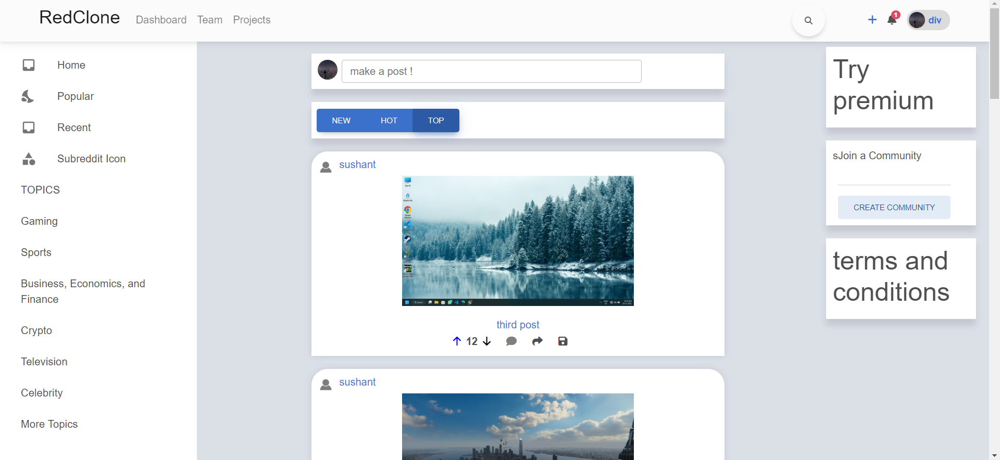
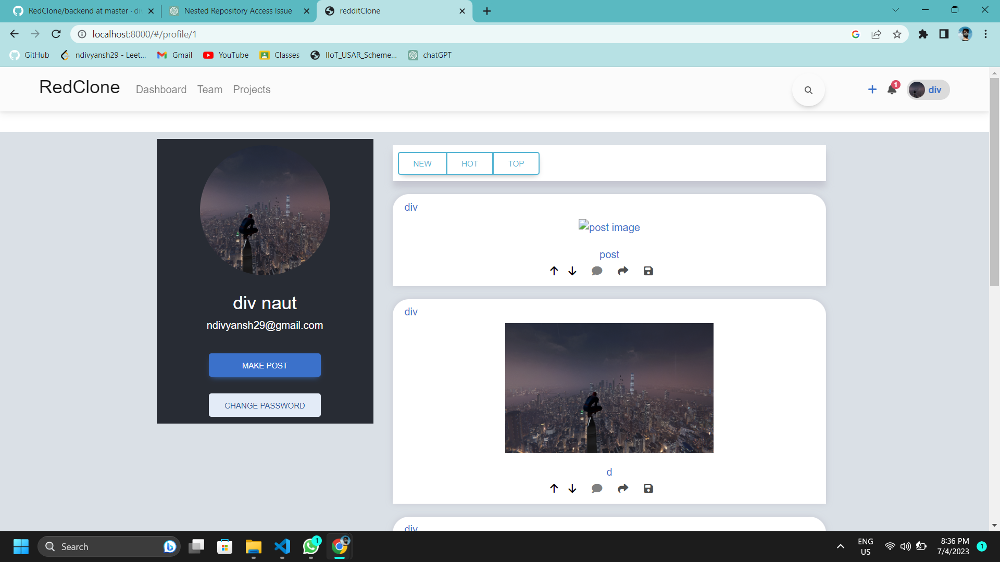
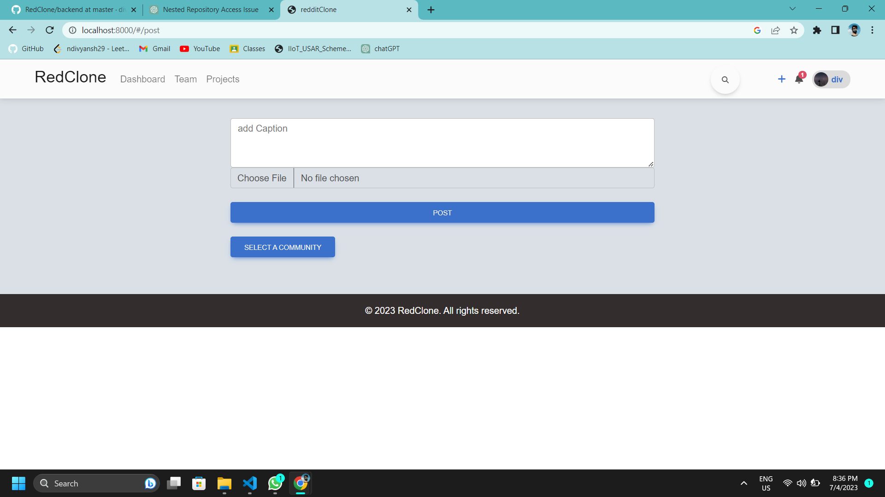
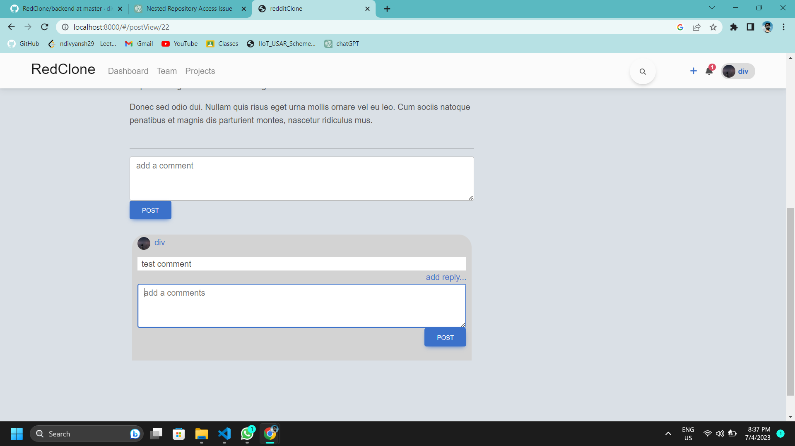
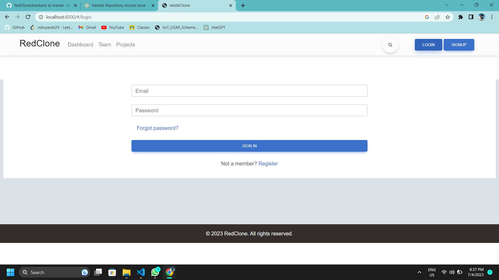
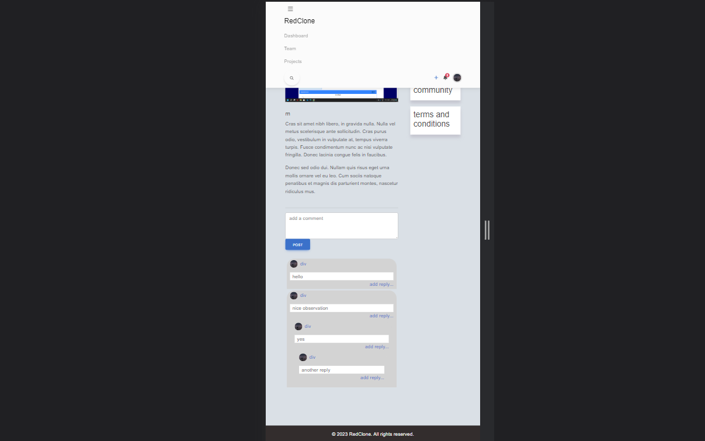

Certainly! Here's a sample README file for your RedClone social media clone app:

# RedClone

RedClone is a social media clone app built with Django in the backend and React in the frontend. It aims to replicate the basic functionality of a social media platform, including user authentication, posting photos/videos, likes/upvotes, sorting posts, search functionality, and a comment and reply system.

## Features

- User Authentication: RedClone uses Djoser for user authentication, allowing users to register, log in, and manage their accounts.
- Posting Media: Users can add photos and videos to share with others.
- Likes/Upvotes: RedClone implements an upvote-downvote system to enable users to express their preferences on posts.
- Sorting Posts: Posts can be sorted based on hotness, top, or newness, providing users with different ways to view content.
- Search Functionality: RedClone allows users to search for specific posts using keywords or filters.
- Comment and Reply System: The app includes a tree-type comment and reply section for users to engage in discussions.

## Technologies Used

- Backend: Django, Djoser, Django Rest Framework , JWT authentication
- Frontend: React, React Material UI

## Screenshots

